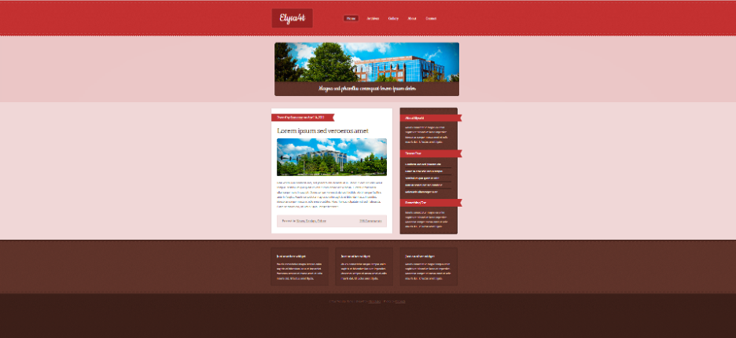

<h1 align="center">МИНИСТЕРСТВО НАУКИ И ВЫСШЕГО ОБРАЗОВАНИЯ РОССИЙСКОЙ ФЕДЕРАЦИИ ФЕДЕРАЛЬНОЕ ГОСУДАРСТВЕННОЕ БЮДЖЕТНОЕ ОБРАЗОВАТЕЛЬНОЕ УЧРЕЖДЕНИЕ ВЫСШЕГО ОБРАЗОВАНИЯ «САХАЛИНСКИЙ ГОСУДАРСТВЕННЫЙ УНИВЕРСИТЕТ»</h1>
<p align="center">Лабораторная работа №7</p>
<p align="center">"CSS"</p>
<br>
<p align="right">Работу выполнила Чёо Эрика Ильинична</p>
<p align="right">Работу проверил Соболев Евгений Игоревич</p>

___

### **Цели и задачи:**
Повторить страницу по образцу, используя элементы из архива lab7.zip:


___

### **Код страницы:**
```html
<!DOCTYPE html>
<html lang="en">
<head>
    <meta charset="UTF-8">
    <meta http-equiv="X-UA-Compatible" content="IE=edge">
    <meta name="viewport" content="width=device-width, initial-scale=1.0">
    <link rel="stylesheet" href="style.css"> 
    <link href="https://fonts.googleapis.com/css2?family=Arvo&family=Cookie&family=Lato&display=swap" rel="stylesheet"> 
    <title>Document</title>
</head>
<body style="margin: 0px; padding: 0px; background-image: url(lab7/wrapper-bg.png);">
    <div style="background-image: url(lab7/header-wrapper-bg.png); height:187px; text-align: center; ">
        <div style="margin: auto; padding-top: 35px; text-align: center; display: flex; align-items: center;  width: 1000px; font-family: Arvo;">
            <span class="name">
                Elysa4t
            </span> 
            <div id="left"></div>
            <div id="curr">
                <span style="float: left; width: 50px; height: 65px; color: white; font-size: 16px; padding-top: 10px; cursor: pointer;">
                    Home
                </span>
            </div>
            <span id="right"></span> 
            <span class="but">
                Archives
            </span>  
            <span class="but">
                Gallery
            </span> 
            <span class="but">
                About
            </span> 
            <span class="but">
                Contact
            </span>
        </div>
    </div>

    <div style="background-image: url(lab7/banner-wrapper-bg.png); height: 350px">
        <div style="width: 1000px; margin: auto; padding-top: 30px; align-items: center;">
             
                <div style="background: url(lab7/footer-content-bg-02.png); width: 960px; height: 80px; margin-top: 210px; border-radius: 8px; position: absolute; 
                color: white; text-align: center; margin-left: 20px;">
                    <p style="margin: 0px; padding-top: 20px; font-size: 35px; font-family: 'Cookie'; "><b>Magna sed phasellus consequat lorem ipsum dolor</b></p>
                </div>
        </div>
    </div>

    <div style="background-image: url(lab7/page-wrapper-bg.png); height: 670px; text-align: center; display: flex; padding-left: 30px; padding-right: 30px; 
    align-items: center; justify-content: center;">
        <div style="margin-bottom: 35px; margin-top: 35px; display: flex; width: 1000px;">
            <div style="float: left; width: 670px; height: 610px; background-color: white; border-radius: 2px; margin-right: 45px;">
                <div>
                    
                    <p id="posttext">Posted by <span style="text-decoration: underline;">Someone</span> on April 14, 2012</p>
                </div>
                <br>
                <span id="lorem">Lorem ipsum sed veroeros amet</span>
                
                <br>
                <p id="posttext2">Nam vestibulum hendrerit orci, sed pharetra elit elementum in. 
                    Donec in eros sed odio varius tempus. 
                    Vestibulum quis quam et velit rutrum ornare nec a massa. 
                    Curabitur malesuada ullamcorper nunc in suscipit. 
                    Donec semper venenatis dui sed facilisis. 
                    Morbi congue facilisis ante in feugiat. 
                    Mauris consectetur magna eu enim sagittis et bibendum lacus imperdiet. 
                    aecenas semper massa ac odio ornare sodales. 
                    Nunc rhoncus vulputate nisi sed malesuada. 
                    Fusce ac mauris dui, id luctus ligula. 
                    Integer hendrerit.
                </p>
                <div id="lastpost">
                    <span id="lasttext">Posted in <span id="lasttext_style1">News</span>, 
                        <span id="lasttext_style1">Design</span>, <span id="lasttext_style1">Other</span></span> 
                        <span id="lasttext_style2">235 Comments</span>
                </div>
            </div>

            <div style="float: left; width: 380px; height: 610px; border-radius: 5px; margin-bottom: 10px;">
                <div style="background-image: url(lab7/sidebar-bg-01.png); background-repeat: no-repeat; height: 15px;"> </div>
                <div style="background-image: url(lab7/sidebar-bg-02.png); background-repeat: repeat-y; height: 580px;">
                        <div style="height: 145px;">
                            
                            <p id="posttext" style="margin-top: 25px;"><b>About Elysa4t</b></p>
                            <p id="sba">Mauris consectetur magna eu enim sagittis et bibendum lacus imperdiet.
                                Maecenas semper massa amet et odio mauris dui, id luctus amet ligula.</p>
                        </div>
                        <div style="height: 250px;">
                            
                            <p id="posttext" style="margin-top: 30px;"><b>Recent Post</b></p>
                            <p id="rec" style="margin-top: 75px; font-size: 14px;"><b>Hendrerit orci sed pharetra elit</b></p>
                            <hr id="line" color="#301c16" style="margin-top: 95px;">
                            <p id="rec" style="margin-top: 115px; font-size: 14px;"><b>Donec in eros odio varius tempus</b></p>
                            <hr id="line" color="#301c16" style="margin-top: 135px;">
                            <p id="rec" style="margin-top: 155px; font-size: 14px;"><b>Vestibulum quis quam et velit</b></p>
                            <hr id="line" color="#301c16" style="margin-top: 175px;">
                            <p id="rec" style="margin-top: 195px; font-size: 14px;"><b>Rutrum ornare nec sed curabitur</b></p>
                            <hr id="line" color="#301c16" style="margin-top: 215px;">
                            <p id="rec" style="margin-top: 235px; font-size: 14px;"><b>Malesuada ullamcorper nunc</b></p>
                        </div>
                        <div style="height: 185px;">
                            
                            <p id="posttext" style="margin-top: 35px;"><b>Something Else</b></p>
                            <p id="sba" style="margin-top: 80px;">Mauris consectetur magna eu enim sagittis et bibendum lacus imperdiet. 
                                Maecenas semper massa amet et odio mauris dui, id luctus amet ligula.</p>
                        </div>
                </div>
                <div style="background-image: url(lab7/sidebar-bg-03.png); background-repeat: no-repeat; height: 15px;"></div>
            </div>
        </div>
    </div>
    
    <div style="background-image: url(lab7/footer-content-bg-02.png); height: 255px;">
        <div style="width: 1000px; margin: auto; color: #ceaba4; align-items: center; display: flex;">
            <div style="width: 300px; float: left; margin-right: 30px;">
                <div id="top"></div>
                <div id="middle">
					<h4 style="color: white; margin-top: 5px;">Just another widget</h4>
					<p style="font-size: 15px; line-height: 20px;">Mauris consectetur magna tempus enim sagittis et bibendum lacus et imperdiet. 
                        Maecenas semper et massa amet et odio mauris dui, id luctus amet ligula.</p>
                </div>
                <div id="bottom"></div>
			</div>
            <div style="width: 300px; float: left; margin-right: 30px;">
                <div id="top"></div>
                <div id="middle">
					<h4 style="color: white; margin-top: 5px;">Just another widget</h4>
					<p style="font-size: 15px; line-height: 20px;">Mauris consectetur magna tempus enim sagittis et bibendum lacus et imperdiet. 
                        Maecenas semper et massa amet et odio mauris dui, id luctus amet ligula.</p>
                </div>
                <div id="bottom"></div>
			</div>
            <div style="width: 300px; float: left;">
                <div id="top"></div>
                <div id="middle">
					<h4 style="color: white; margin-top: 5px;">Just another widget</h4>
					<p style="font-size: 15px; line-height: 20px;">Mauris consectetur magna tempus enim sagittis et bibendum lacus et imperdiet. 
                        Maecenas semper et massa amet et odio mauris dui, id luctus amet ligula.</p>
                </div>
                <div id="bottom"></div>
			</div>
        </div>
    </div>

    <div style="background-image: url(lab7/footer-bg.png); height: 120px;">
        <br>
        <p style="text-align: center; font-size: 15px; color: rgba(170, 112, 73, 0.486);"> &copy Your website Name | Elysa4t by <span style="text-decoration: underline; cursor: pointer;">4Templates</span> 
            | Photos by <span style="text-decoration: underline; cursor: pointer;">Fotogrph</span></p>
    </div>
</body>
</html>
</html>
```

___

### **Вывод:**
После выполнения данной лабораторной работы я повысила свои навыки работы с HTML и CSS
